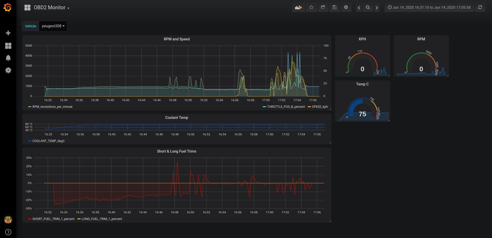

# OBD2 Auto Telemetry Collector (ATC)


!! This all works, but you need to do a few manual things at the moment.

* Record live ODB2 Data into Grafana
* Dump out the fault codes
* Reset Fault Codes

* Read and display Fault Codes, into the graphs. (coming)



This project uses, and depends upon the following projects.

- python-obd
- statsd
- graphite
- grafana

It is all packaged in a set of docker containers to make it easier to run.

Cars don't always support all telemetry data, variations in ECU's etc.

ATC needs to know the codes to track. 
ATC has some commandline support to make that happen.

Once the codes supported by the car are determined, all the stats collection is automatic. 

## Step 1 - Building the Container

```
make inosion/auto-telemetry
```

## Step 2 - Creating the Config

The config file needs to nominate which codes to track.

The config format is YAML. and needs two sections, `name` and `codes-to-monitor`
```yaml
name: Peugeot308
codes-to-monitor:
  - RPM
  - SPEED
  - COOLANT_TEMP
  - INTAKE_TEMP
  - THROTTLE_POS_B
  - LONG_FUEL_TRIM_1
  - SHORT_FUEL_TRIM_1
  - INTAKE_PRESSURE
  - FUEL_RAIL_PRESSURE_DIRECT
```
To obtain, generate this list; run the following. 

```
docker run -ti --rm --privileged -v /dev:/dev inosion/auto-telemetry inspect --device /dev/ttyUSB0
```

Copy the output you need to your own config file.

## Step 3 - Run the Collector

```
ATC_CONFIG=auto-telemetry-config-Peugeot308.yaml docker-compose up
```

### 3.1 Launch Grafana

Now you can browse to 

[grafana](http://localhost:3000)

Login details:
- Username: `admin`
- Password: `admin`

### 3.2 Import the dashboard

Click on the `+` on the left menu, choose import, and import the [grafana-dashboard](grafana/OBD2-Monitor-1592132703021.json)

## Clearing the codes

```
docker run -ti --rm --privileged -v /dev:/dev inosion/auto-telemetry clear --device /dev/ttyUSB0
```
You get back a 
```
None
```

## Inspecting the car
```
docker run -ti --rm --privileged -v /dev:/dev inosion/auto-telemetry inspect --device /dev/ttyUSB0
```
will return 
```
- DTC_SHORT_FUEL_TRIM_1 # DTC Short Term Fuel Trim - Bank 1 on 2
- COOLANT_TEMP # Engine Coolant Temperature on 2
- O2_SENSORS # O2 Sensors Present on 2
- DTC_STATUS # DTC Status since DTCs cleared on 2
- MIDS_F # Supported MIDs [A1-C0] on 255
- MONITOR_O2_B1S1 # O2 Sensor Monitor Bank 1 - Sensor 1 on 255
- CLEAR_DTC # Clear DTCs and Freeze data on 255
- DTC_FUEL_RAIL_PRESSURE_DIRECT # DTC Fuel Rail Pressure (direct inject) on 2
- MONITOR_O2_HEATER_B1S1 # O2 Sensor Heater Monitor Bank 1 - Sensor 1 on 255
- ELM_VOLTAGE # Voltage detected by OBD-II adapter on 1
- DTC_ENGINE_LOAD # DTC Calculated Engine Load on 2
- DTC_COOLANT_TEMP # DTC Engine Coolant Temperature on 2
- DTC_LONG_FUEL_TRIM_1 # DTC Long Term Fuel Trim - Bank 1 on 2
- MIDS_A # Supported MIDs [01-20] on 255
- DTC_O2_SENSORS # DTC O2 Sensors Present on 2
- DTC_THROTTLE_POS_B # DTC Absolute throttle position B on 2
- DTC_O2_B1S2 # DTC O2: Bank 1 - Sensor 2 Voltage on 2
- PIDS_B # Supported PIDs [21-40] on 2
- DTC_PIDS_C # DTC Supported PIDs [41-60] on 2
- DTC_RPM # DTC Engine RPM on 2
- FUEL_RAIL_PRESSURE_DIRECT # Fuel Rail Pressure (direct inject) on 2
- INTAKE_TEMP # Intake Air Temp on 2
- TIMING_ADVANCE # Timing Advance on 2
- DTC_INTAKE_TEMP # DTC Intake Air Temp on 2
- THROTTLE_POS # Throttle Position on 2
- FUEL_STATUS # Fuel System Status on 2
- INTAKE_PRESSURE # Intake Manifold Pressure on 2
- DTC_OBD_COMPLIANCE # DTC OBD Standards Compliance on 2
- MONITOR_MISFIRE_CYLINDER_3 # Misfire Cylinder 3 Data on 255
- MONITOR_O2_HEATER_B1S2 # O2 Sensor Heater Monitor Bank 1 - Sensor 2 on 255
- SPEED # Vehicle Speed on 2
- DISTANCE_W_MIL # Distance Traveled with MIL on on 2
- DTC_TIMING_ADVANCE # DTC Timing Advance on 2
- O2_B1S2 # O2: Bank 1 - Sensor 2 Voltage on 2
- OBD_COMPLIANCE # OBD Standards Compliance on 2
- MONITOR_MISFIRE_CYLINDER_2 # Misfire Cylinder 2 Data on 255
- DTC_INTAKE_PRESSURE # DTC Intake Manifold Pressure on 2
- DTC_DISTANCE_W_MIL # DTC Distance Traveled with MIL on on 2
- DTC_SPEED # DTC Vehicle Speed on 2
- MIDS_E # Supported MIDs [81-A0] on 255
- RPM # Engine RPM on 2
- THROTTLE_POS_B # Absolute throttle position B on 2
- MIDS_D # Supported MIDs [61-80] on 255
- GET_CURRENT_DTC # Get DTCs from the current/last driving cycle on 255
- DTC_FUEL_STATUS # DTC Fuel System Status on 2
- MIDS_C # Supported MIDs [41-60] on 255
- MONITOR_O2_B1S2 # O2 Sensor Monitor Bank 1 - Sensor 2 on 255
- DTC_O2_S1_WR_CURRENT # DTC 02 Sensor 1 WR Lambda Current on 2
- MONITOR_MISFIRE_CYLINDER_4 # Misfire Cylinder 4 Data on 255
- STATUS # Status since DTCs cleared on 2
- GET_DTC # Get DTCs on 255
- DTC_PIDS_B # DTC Supported PIDs [21-40] on 2
- SHORT_FUEL_TRIM_1 # Short Term Fuel Trim - Bank 1 on 2
- LONG_FUEL_TRIM_1 # Long Term Fuel Trim - Bank 1 on 2
- O2_S1_WR_CURRENT # 02 Sensor 1 WR Lambda Current on 2
- PIDS_C # Supported PIDs [41-60] on 2
- MONITOR_CATALYST_B1 # Catalyst Monitor Bank 1 on 255
- MIDS_B # Supported MIDs [21-40] on 255
- MONITOR_MISFIRE_CYLINDER_1 # Misfire Cylinder 1 Data on 255
- ELM_VERSION # ELM327 version string on 1
- PIDS_A # Supported PIDs [01-20] on 2
- ENGINE_LOAD # Calculated Engine Load on 2
- DTC_THROTTLE_POS # DTC Throttle Position on 2
------ current fault codes -----
P1336 - 
P1339 - 
P1340 - 
```

## Known Issues
- Using a bluetooth OBD2 dongle should work, it needs some coding to make it automatic.
- The grafana dashboard is not automatically available.
- The codes are not yet monitored, just available via command line.

## Future
- fix known issues
- Automatically collect and have a graph for the telemetry supported by the car. 
- show a table of all live data